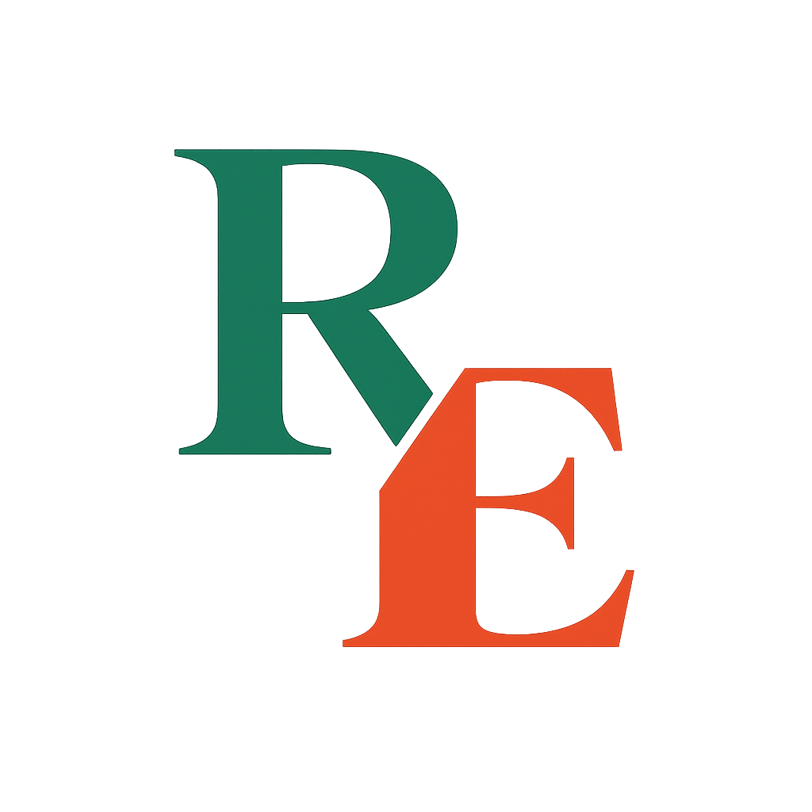

# RentEase

  

<h1 align="center">
  RentEase
</h1>

  A modern furniture and appliance rental website built using HTML, CSS, JavaScript, and Firebase.

## About The Project

RentEase is a responsive rental platform designed for students and working professionals who want affordable furniture and appliances without the hassle of ownership.

The project focuses on creating a clean and modern user experience with smooth animations, dark mode support, and Firebase integration for authentication and database functionality.

# Features

### Frontend

- Responsive design
- Modern UI/UX
- Dark mode
- Smooth animations
- Product showcase section
- Pricing plans
- Interactive cards
- Mobile-friendly layout

### Backend (Firebase)

- User authentication
- Firestore database
- Rental request storage
- Firebase integration

# Future Improvements

- Admin dashboard
- Online payments
- Product filtering
- Wishlist system
- User profiles
- Order tracking
- Notifications

# Author

Kamalesh Jonnadula

# License

This project is created for educational and portfolio purposes.
